

  <b>🌐 Język / Language:</b> &nbsp;
  <a href="#pl">Polski</a>
  &nbsp;|&nbsp;
  <a href="#en">English</a>

---

<h1 align="center">💪 BestFormPT</h1>

  <strong>System Zarządzania Studio Personalnego &nbsp;·&nbsp; Projekt Komercyjny</strong> 
  Pełnostackowa platforma do zarządzania siłownią — projektowana i budowana od zera, od architektury do działającego MVP.

  
  
  
  
  
  
  
  
  
  

  
   <i>Kliknij, aby otworzyć pełny ekran</i>

---

## 📌 Spis treści

- [✨ Najważniejsze funkcje techniczne](#-najważniejsze-funkcje-techniczne)
- [📅 Widoki kalendarza](#-widoki-kalendarza)
- [🖱️ Drag & Drop — Planowanie zajęć](#️-drag--drop--planowanie-zajęć)
- [🌓 Tryb ciemny / jasny](#-tryb-ciemny--jasny)
- [📋 Nawigacja i filtry](#-nawigacja-i-filtry)
- [📝 Okno tworzenia wydarzeń](#-okno-tworzenia-wydarzeń)
- [📅 Wydarzenia cykliczne (roczne)](#-wydarzenia-cykliczne-roczne)
- [👤 Rejestracja i aktywacja konta](#-rejestracja-i-aktywacja-konta)
- [🔐 Strona logowania](#-strona-logowania)

---

## ✨ Najważniejsze funkcje techniczne

### 🖥️ Frontend — Angular

| Obszar                      | Szczegóły                                                                                                                                |
| --------------------------- | ---------------------------------------------------------------------------------------------------------------------------------------- |
| **Architektura**            | Wzorzec smart/dumb komponentów, moduły ładowane leniwie (lazy loading)                                                                   |
| **Biblioteka UI**           | Angular Material — komponenty, dialogi, snackbary, pola formularzy                                                                       |
| **Zarządzanie stanem**      | NgRx z efektami, selektorami i reducerami — pełny jednokierunkowy przepływ danych                                                        |
| **Wydajność**               | Detekcja zmian `OnPush`, Angular Signals, bloki `@defer` dostosowane do widoku lub sygnału `BreakpointObserver`                          |
| **Własny kalendarz**        | Zbudowany od zera — widoki: dzienny, tygodniowy, miesięczny; obsługa dat przez Moment.js                                                 |
| **Drag & Drop**             | Angular CDK Drag & Drop z **automatycznym przewijaniem krawędzi** (`pointermove`), nawigacją klawiaturą (← →) i obsługą dotyku na mobile |
| **Angular CDK**             | `BreakpointObserver` do adaptacyjnych układów mobile/desktop; używany w kalendarzu i narzędziach drag                                    |
| **Dostępność klawiaturowa** | Strzałki nawigują między dniami/tygodniami/miesiącami                                                                                    |
| **Responsywność**           | W pełni responsywny na desktopie, tablecie i telefonie — zgodność z najlepszymi praktykami dostępności                                   |
| **Motywy**                  | Dynamiczny przełącznik motywu ciemny/jasny                                                                                               |

### ⚙️ Backend — Laravel

| Obszar                | Szczegóły                                                                       |
| --------------------- | ------------------------------------------------------------------------------- |
| **API**               | RESTful Laravel API ze strukturalnymi odpowiedziami zasobów                     |
| **Uwierzytelnianie**  | Laravel Sanctum — uwierzytelnianie tokenowe z bezpiecznym zarządzaniem sesją    |
| **Walidacja**         | Solidna walidacja po stronie serwera z opisowymi odpowiedziami błędów           |
| **Integracja e-mail** | Mailgun (przez `symfony/mailgun-mailer`) do e-maili aktywacyjnych i powiadomień |
| **Testy**             | Testy jednostkowe i integracyjne PHPUnit pokrywające główną logikę biznesową    |

### 🐳 Infrastruktura

| Obszar           | Szczegóły                                                               |
| ---------------- | ----------------------------------------------------------------------- |
| **Docker**       | W pełni zdockeryzowany — jedno `docker-compose up` uruchamia cały stack |
| **Dev & Deploy** | Spójne środowiska — od lokalnego developmentu po produkcję              |

---

## 📅 Widoki kalendarza

> Zaawansowany system kalendarza z widokami: dziennym, tygodniowym i miesięcznym — zoptymalizowany dla trenerów i klientów na wszystkich urządzeniach.

### Widok dzienny — Responsywność i nawigacja mobilna

  
   <i>Widok dzienny — pełna responsywność na wszystkich breakpointach + mobilny boczny navbar · Kliknij, aby otworzyć pełny ekran</i>

### Widok tygodniowy — Responsywność

  
   <i>Widok tygodniowy płynnie dostosowuje się od desktopu do telefonu · Kliknij, aby otworzyć pełny ekran</i>

### Widok miesięczny — Responsywność i wydarzenia cykliczne

  
   <i>Responsywność widoku miesięcznego na wszystkich urządzeniach · Kliknij, aby otworzyć pełny ekran</i>

  <a target="_blank" href="BestFormPT/gifs/month-view-trainings-dispalying-and-adding-annual-events.gif">
    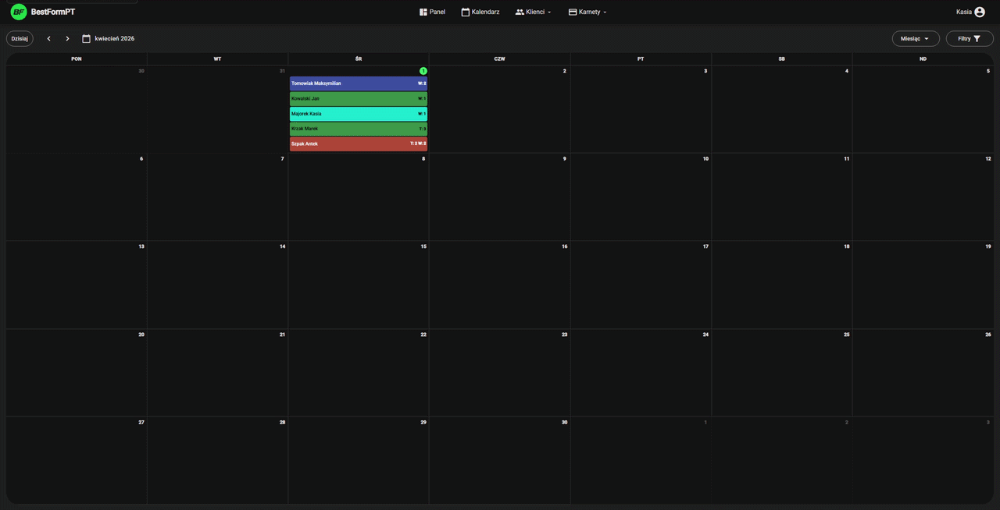
  </a>
   <i>Widok miesięczny — przeglądanie treningów i planowanie wydarzeń cyklicznych · Kliknij, aby otworzyć pełny ekran</i>

---

## 🖱️ Drag & Drop — Planowanie zajęć

> Drag & Drop z CDK Angulara — z **automatycznym przewijaniem krawędzi**.

### Drag & Drop — Dodawanie wydarzenia + Snackbar sukcesu / ostrzeżenia

  <a target="_blank" href="BestFormPT/gifs/drag-and-drop-adding-event-and-succes-and-warning-snackbar.gif">
    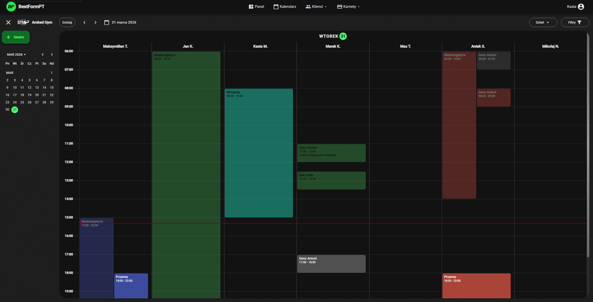
  </a>
   <i>Przeciągnij kartę na kalendarz, aby utworzyć wydarzenie — snackbary sukcesu i ostrzeżenia dają natychmiastowy feedback · Kliknij, aby otworzyć pełny ekran</i>

### Drag & Drop — Zmiana rozmiaru, czasu i trenera

  <a target="_blank" href="BestFormPT/gifs/drag-and-drop-updating-event-resizing-changing-time-and-trainer.gif">
    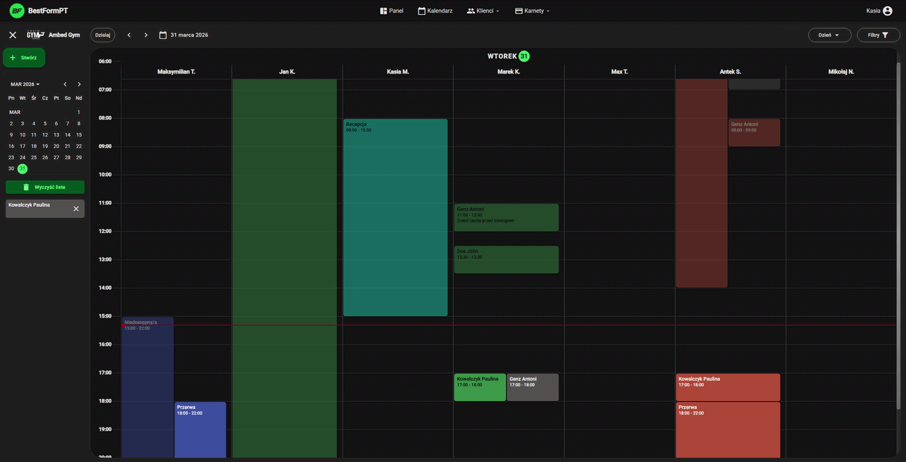
  </a>
   <i>Zmień rozmiar, przesuń slot czasowy lub przypisz innego trenera — wszystko przez drag · Kliknij, aby otworzyć pełny ekran</i>

### Drag & Drop — Błąd walidacji (czas musi być w przyszłości)

  <a target="_blank" href="BestFormPT/gifs/drag-and-drop-updating-event-error-time-neds-to-be-in-future.gif">
    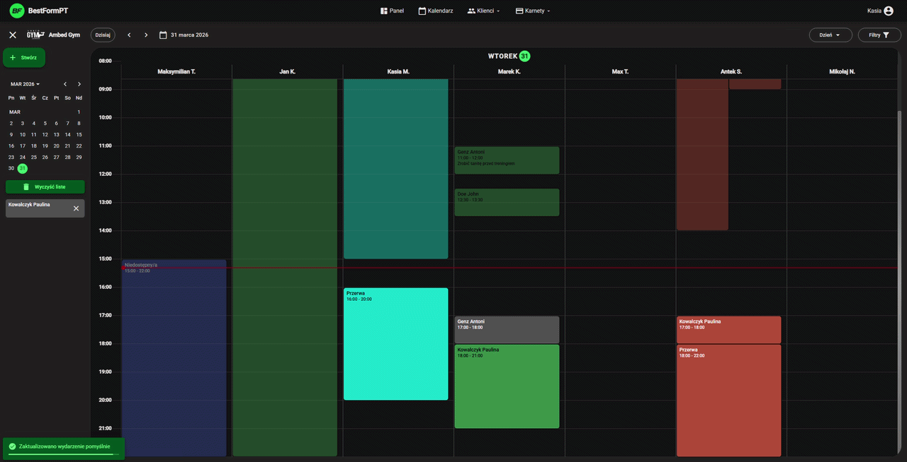
  </a>
   <i>Walidacja serwerowa wychwytuje planowanie w przeszłości — natychmiast wyświetlany jest snackbar błędu · Kliknij, aby otworzyć pełny ekran</i>

### Widok tygodniowy — Przewijanie krawędzi, dodawanie wydarzeń i nawigacja

  
   <i>Automatyczne przewijanie aktywuje się przy przeciąganiu w pobliżu krawędzi ekranu — płynne, natywne doświadczenie · Kliknij, aby otworzyć pełny ekran</i>

---

## 🌓 Tryb ciemny / jasny

  
   <i>Przełącznik motywu jednym kliknięciem — tryb ciemny i jasny we wszystkich widokach · Kliknij, aby otworzyć pełny ekran</i>

---

## 📋 Nawigacja i filtry

> Intuicyjna nawigacja z inteligentnym filtrowaniem klientów — zoptymalizowana pod workflow trenerów na wszystkich urządzeniach.

|                                           🍔 Boczna nawigacja (Mobile)                                            |                                                           🔍 Filtr klientów (Desktop)                                                           |                                                        🔍 Filtr klientów (Mobile)                                                        |
| :---------------------------------------------------------------------------------------------------------------: | :---------------------------------------------------------------------------------------------------------------------------------------------: | :--------------------------------------------------------------------------------------------------------------------------------------: |
| [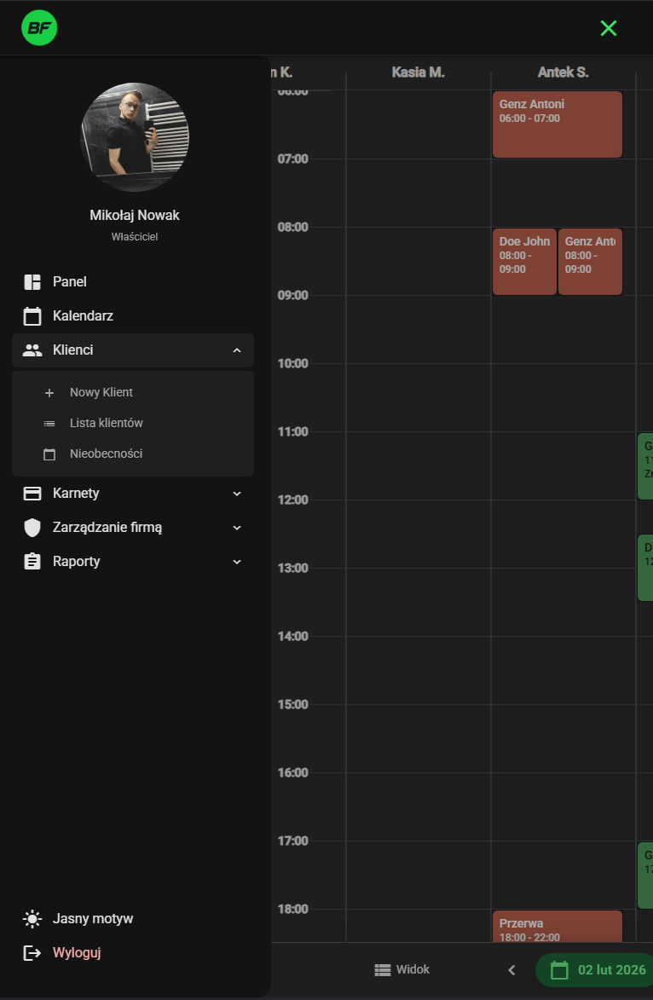](BestFormPT/screenshots/3-app-side-nav-mobile.png) | [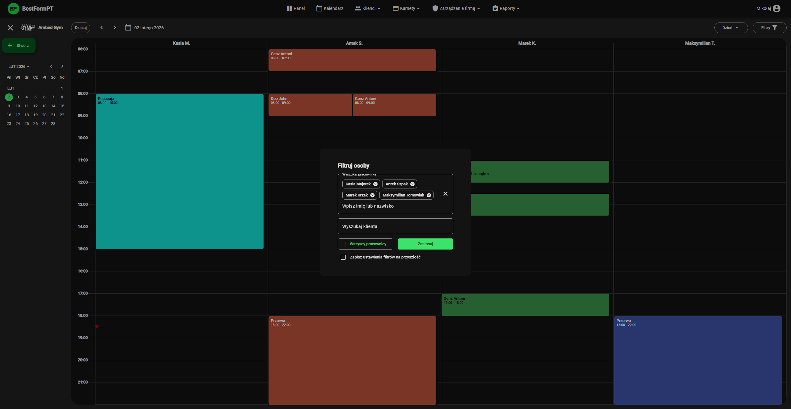](BestFormPT/screenshots/5-app-calendar-filters-screenshot.png) | [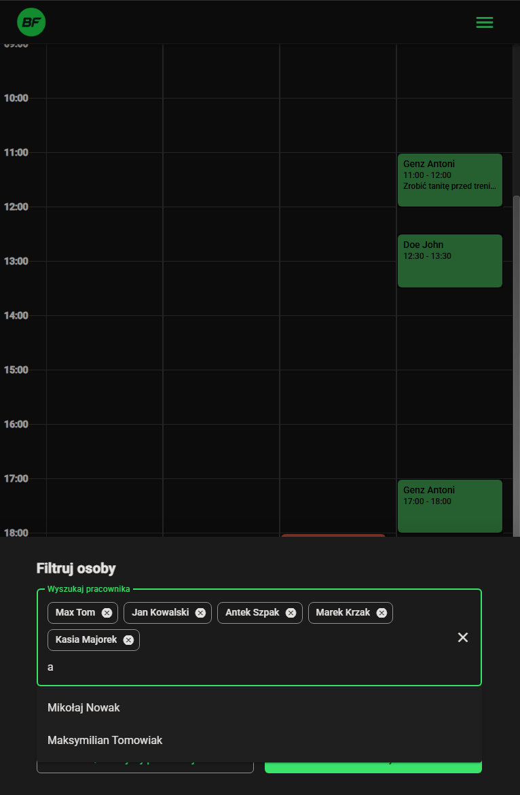](BestFormPT/screenshots/6-app-mobile-filter-screenshot.png) |
|                                              _Mobilny boczny navbar_                                              |                                                       _Panel filtrów klientów — desktop_                                                        |                                                    _Panel filtrów klientów — mobile_                                                     |

---

## 📝 Okno tworzenia wydarzeń

> Przejrzyste okna modalne do tworzenia i edycji sesji treningowych — w pełni responsywne na desktopie i telefonie.

|                                                                📱 Dodaj wydarzenie (Mobile)                                                                 |                                                                          📱 Dodaj wydarzenie cykliczne — Krok 1                                                                          |                                                                          📱 Dodaj wydarzenie cykliczne — Krok 2                                                                          |
| :---------------------------------------------------------------------------------------------------------------------------------------------------------: | :--------------------------------------------------------------------------------------------------------------------------------------------------------------------------------------: | :--------------------------------------------------------------------------------------------------------------------------------------------------------------------------------------: |
| [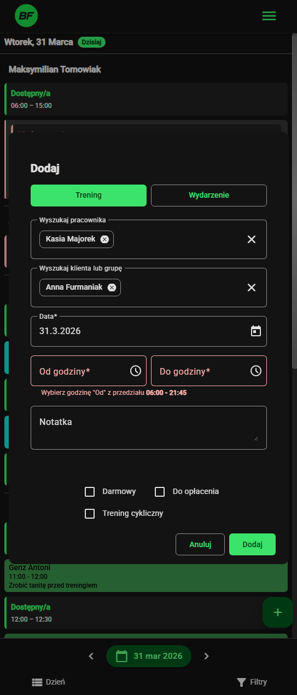](BestFormPT/screenshots/1.7-app-calendar-add-event-mobile-form.png) | [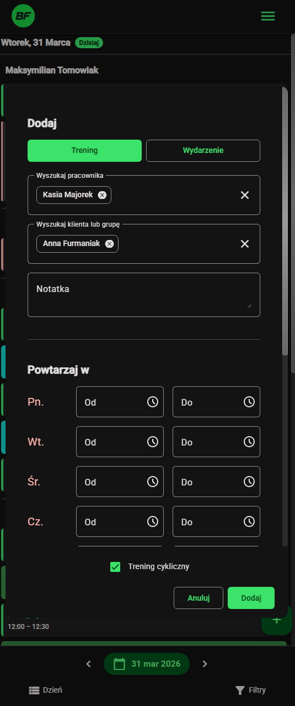](BestFormPT/screenshots/1.7.1-app-calendar-add-annyally-event-mobile-form.png) | [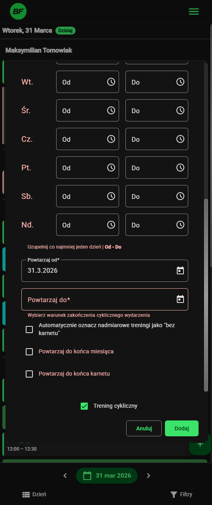](BestFormPT/screenshots/1.7.2-app-calendar-add-annyally-event-mobile-form.png) |
|                                                        _Standardowy formularz tworzenia wydarzenia_                                                         |                                                                             _Wydarzenie cykliczne — krok 1_                                                                              |                                                                             _Wydarzenie cykliczne — krok 2_                                                                              |

---

## 📅 Wydarzenia cykliczne

> Planowanie powtarzających się wydarzeń przy użyciu formularza.

  
   <i>Przeglądanie istniejących sesji treningowych i dodawanie wydarzeń cyklicznych · Kliknij, aby otworzyć pełny ekran</i>

---

## 👤 Rejestracja i aktywacja konta

> Płynny wieloetapowy onboarding z aktywacją konta przez e-mail.

### Rejestracja — Formularz wieloetapowy

  <a target="_blank" href="BestFormPT/screenshots/7.1-app-new-user-form.png">
    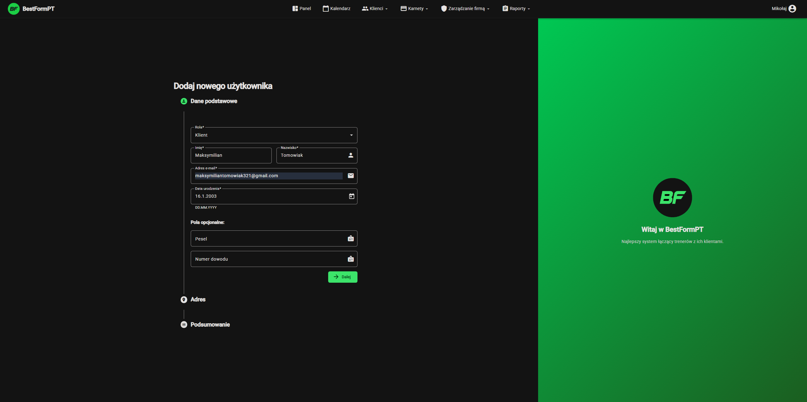
  </a>
  &nbsp;
  <a target="_blank" href="BestFormPT/screenshots/7.2-app-new-user-form.png">
    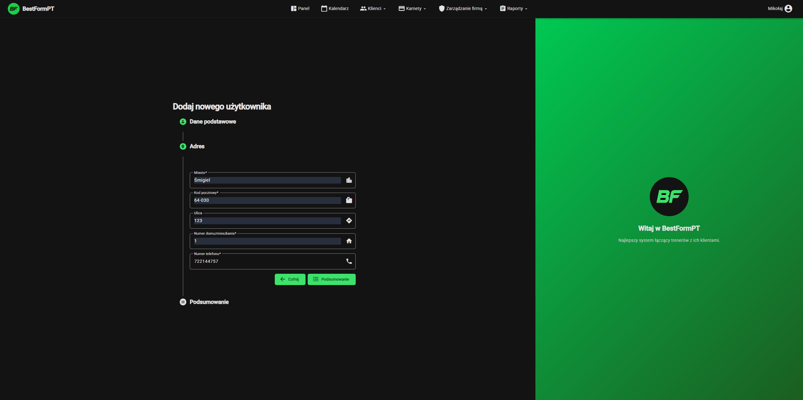
  </a>
  &nbsp;
  <a target="_blank" href="BestFormPT/screenshots/7.3-app-new-user-form.png">
    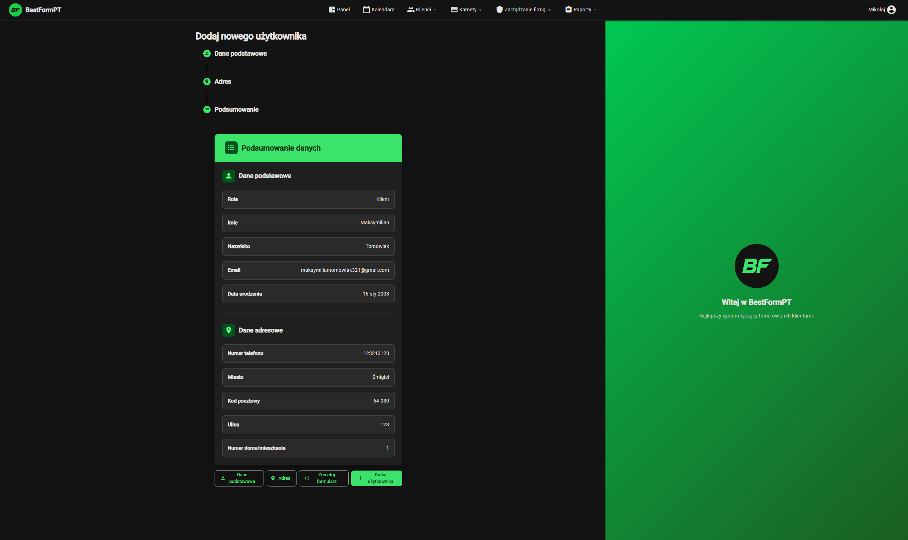
  </a>

<i>Wieloetapowy formularz rejestracji — kliknij dowolny obrazek, aby go powiększyć</i>

### Aktywacja konta

|                                                              ✉️ E-mail aktywacyjny                                                              |                                                             ✅ Formularz aktywacji                                                             |
| :---------------------------------------------------------------------------------------------------------------------------------------------: | :--------------------------------------------------------------------------------------------------------------------------------------------: |
| [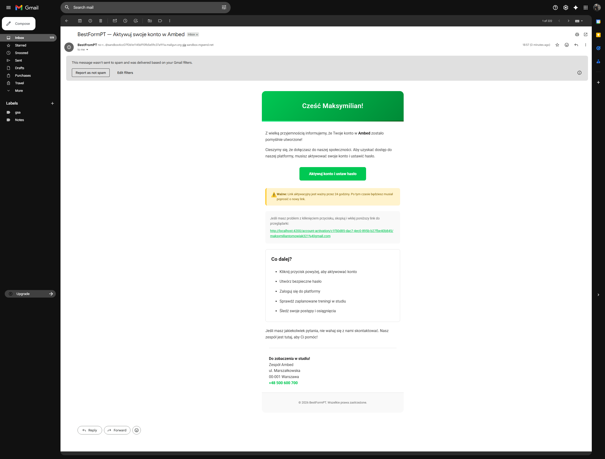](BestFormPT/screenshots/8-app-activation-mail-screenshot.png) | [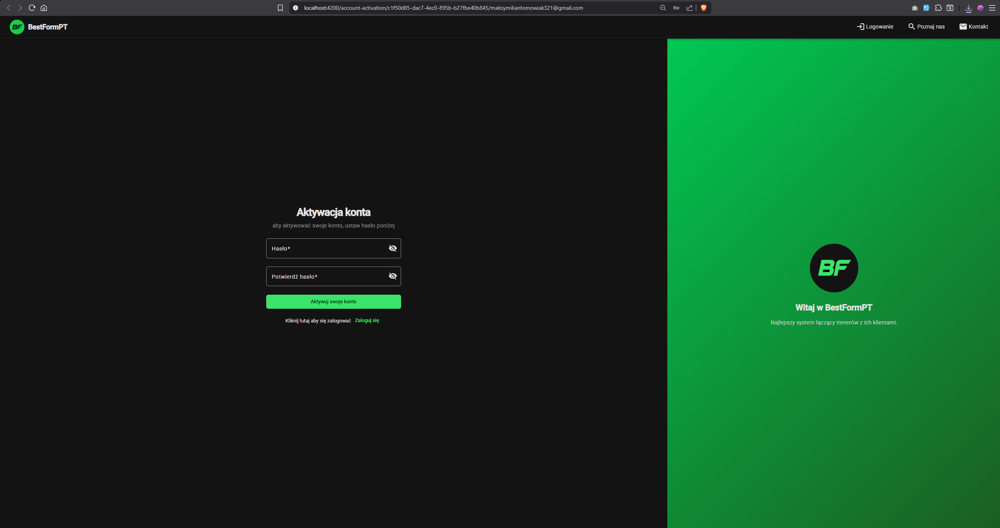](BestFormPT/screenshots/9-app-activation-form-screenshot.png) |
|                                                       _E-mail wysłany przez Mailgun API_                                                        |                                                         _Formularz aktywacji tokenem_                                                          |

---

## 🔐 Strona logowania

> Bezpieczne, minimalistyczne logowanie dla trenerów i klientów.

  <a target="_blank" href="BestFormPT/screenshots/10-app-login-page-screenshot.png">
    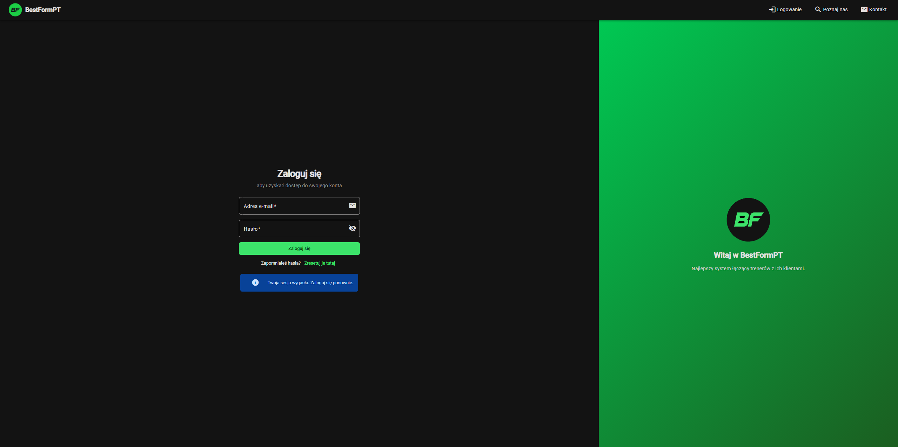
  </a>
   <i>Kliknij, aby otworzyć pełny ekran</i>

---

  Kalendarz jest fragmentem całej aplikacji – co prawda najważniejszy – jednak nie uwzględniono tutaj wszystkich jej funkcjonalności. · Zrzuty ekranu i nagrania zrobiono na Chrome i urządzeniach mobilnych

<a href="#pl">⬆ Powrót na górę</a>

---

<h1 align="center">💪 BestFormPT</h1>

  <strong>Personal Training Studio Management System &nbsp;·&nbsp; Commercial Project</strong> 
  Full-stack gym management platform designed and built from scratch — from architecture to working MVP.

  
  
  
  
  
  
  
  
  
  

  
   <i>Click to open full screen</i>

---

## 📌 Table of Contents

- [✨ Technical Highlights](#-technical-highlights)
- [📅 Calendar Views](#-calendar-views)
- [🖱️ Drag & Drop — Scheduling](#️-drag--drop--scheduling)
- [🌓 Dark / Light Mode](#-dark--light-mode)
- [📋 Navigation & Filters](#-navigation--filters)
- [📝 Event Creation Dialog](#-event-creation-dialog)
- [📅 Annual Events](#-annual-events)
- [👤 User Registration & Activation](#-user-registration--activation)
- [🔐 Login Page](#-login-page)

---

## ✨ Technical Highlights

### 🖥️ Frontend — Angular

| Area                       | Details                                                                                                                                  |
| -------------------------- | ---------------------------------------------------------------------------------------------------------------------------------------- |
| **Architecture**           | Smart/dumb component pattern, lazy-loaded feature modules                                                                                |
| **UI Library**             | Angular Material — components, dialogs, snackbars, form fields                                                                           |
| **State Management**       | NgRx with effects, selectors, and reducers — full unidirectional data flow                                                               |
| **Performance**            | `OnPush` change detection, Angular Signals, optimized rendering pipelines, `@defer` blocks scoped by view or `BreakpointObserver` signal |
| **Custom Calendar**        | Built from scratch — Day, Week, Month views; date handling via Moment.js                                                                 |
| **Drag & Drop**            | Angular CDK Drag & Drop with **edge auto-scrolling** (`pointermove`)                                                                     |
| **Angular CDK**            | `BreakpointObserver` for adaptive mobile/desktop layouts; used across calendar and drag utilities                                        |
| **Keyboard Accessibility** | Arrow keys navigate between days/weeks/months;                                                                                           |
| **Responsive Design**      | Fully responsive across desktop, tablet, and mobile — accessibility best practices throughout                                            |
| **Theming**                | Dynamic dark/light mode toggle with smooth transitions                                                                                   |

### ⚙️ Backend — Laravel

| Area                 | Details                                                                      |
| -------------------- | ---------------------------------------------------------------------------- |
| **API**              | RESTful Laravel API with structured resource responses                       |
| **Authentication**   | Laravel Sanctum — token-based auth with secure session management            |
| **Validation**       | Robust server-side validation with descriptive error responses               |
| **Mail Integration** | Mailgun (via `symfony/mailgun-mailer`) for activation emails & notifications |
| **Testing**          | PHPUnit unit & integration tests covering core business logic                |

### 🐳 Infrastructure

| Area             | Details                                                                 |
| ---------------- | ----------------------------------------------------------------------- |
| **Docker**       | Fully dockerized — single `docker-compose up` spins up the entire stack |
| **Dev & Deploy** | Consistent environments from local development to production            |

---

## 📅 Calendar Views

> A powerful calendar system supporting Day, Week, and Month views — built for both trainers and clients across all screen sizes.

### Day View — Responsive & Mobile Navigation

  
   <i>Day view — full responsiveness across breakpoints + mobile side navbar · Click to open full screen</i>

### Week View — Responsive

  
   <i>Week view adapts seamlessly from desktop to mobile · Click to open full screen</i>

### Month View — Responsive & Annual Events

  
   <i>Month view responsiveness across all devices · Click to open full screen</i>

  
   <i>Month view — viewing trainings and scheduling annual (recurring) events · Click to open full screen</i>

---

## 🖱️ Drag & Drop — Scheduling

> Drag-and-Drop from CDK Angular — with **edge auto-scrolling**

### Drag & Drop — Adding Event + Success / Warning Snackbar

  
   <i>Drag a card onto the calendar to create an event — success and warning snackbars provide instant feedback · Click to open full screen</i>

### Drag & Drop — Resize, Change Time & Trainer

  
   <i>Resize events, shift their time slot, or reassign to a different trainer — all via drag · Click to open full screen</i>

### Drag & Drop — Validation Error (Time Must Be in the Future)

  
   <i>Server-side validation catches past-time scheduling — an error snackbar is shown immediately · Click to open full screen</i>

### Week View — Edge Scrolling, Adding Events & Navigation

  
   <i>Edge auto-scroll activates when dragging near viewport boundaries — smooth, native-feeling experience · Click to open full screen</i>

---

## 🌓 Dark / Light Mode

  
   <i>One-click theme toggle — dark and light modes across all calendar views · Click to open full screen</i>

---

## 📋 Navigation & Filters

> Intuitive navigation with smart client filtering — optimized for trainer workflows across all devices.

|                                            🍔 Side Navigation (Mobile)                                            |                                                           🔍 Client Filter (Desktop)                                                            |                                                        🔍 Client Filter (Mobile)                                                         |
| :---------------------------------------------------------------------------------------------------------------: | :---------------------------------------------------------------------------------------------------------------------------------------------: | :--------------------------------------------------------------------------------------------------------------------------------------: |
|  |  |  |
|                                               _Mobile side navbar_                                                |                                                          _Desktop client filter panel_                                                          |                                                       _Mobile client filter panel_                                                       |

---

## 📝 Event Creation Dialog

> Clean modal dialogs for creating and editing training sessions — fully responsive on desktop and mobile.

|                                                                    📱 Add Event (Mobile)                                                                    |                                                                             📱 Add Recurring Event — Step 1                                                                              |                                                                             📱 Add Recurring Event — Step 2                                                                              |
| :---------------------------------------------------------------------------------------------------------------------------------------------------------: | :--------------------------------------------------------------------------------------------------------------------------------------------------------------------------------------: | :--------------------------------------------------------------------------------------------------------------------------------------------------------------------------------------: |
|  |  |  |
|                                                               _Standard event creation form_                                                                |                                                                                _Recurring event — step 1_                                                                                |                                                                                _Recurring event — step 2_                                                                                |

---

## 📅 Recurring Events

> Scheduling recurring events with form.

  
   <i>Viewing existing training sessions and adding recurring events in month view · Click to open full screen</i>

---

## 👤 User Registration & Activation

> Smooth multi-step onboarding with email-based account activation.

### Registration — Multi-Step Form

  
  &nbsp;
  
  &nbsp;
  

<i>Multi-step registration form — click any image to open full screen</i>

### Account Activation

|                                                               ✉️ Activation Email                                                               |                                                               ✅ Activation Form                                                               |
| :---------------------------------------------------------------------------------------------------------------------------------------------: | :--------------------------------------------------------------------------------------------------------------------------------------------: |
|  |  |
|                                                  _Email notification sent by the mailing API_                                                   |                                                         _Token-based activation form_                                                          |

---

## 🔐 Login Page

> Secure, minimal login experience for trainers and clients.

  
   <i>Click to open full screen</i>

---

  Calendar is only a part of the application; however, it does not include all of its functionalities. · Screenshots and recordings captured across Chrome & mobile devices

<a href="#en">⬆ Back to top</a>

